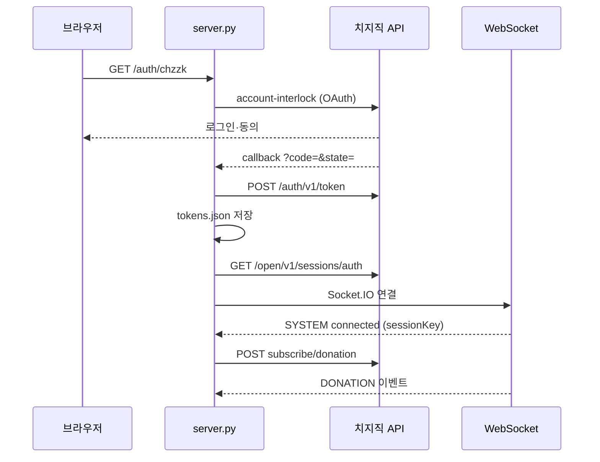

# 치지직 후원 API 테스트 서버

치지직 Open API **Session WebSocket**으로 후원(`DONATION`) 이벤트를 받아 보는 Python 테스트 앱입니다.  
본 프로젝트 본편(Bridge · SteamAPI) 구현 전에 OAuth와 후원 수신이 되는지 확인할 때 사용합니다.

**관련 문서**

- [Session API](https://chzzk.gitbook.io/chzzk/chzzk-api/session)
- [Authorization (OAuth)](https://chzzk.gitbook.io/chzzk/chzzk-api/authorization)
- [참고사항 (Client / Bearer 인증)](https://chzzk.gitbook.io/chzzk/chzzk-api/tips)

---

## 사전 준비 (치지직 개발자 센터)

1. [치지직 Open API](https://chzzk.gitbook.io/chzzk)에서 애플리케이션 등록
2. **Client ID**, **Client Secret** 발급
3. **로그인 리디렉션 URL** 등록
   - 기본값: `http://localhost:3000/auth/chzzk/callback`
   - `.env`의 `CHZZK_REDIRECT_URI`와 **완전히 동일**해야 합니다.
4. Scope에서 **후원 조회** 체크

> 후원 WebSocket은 **스트리머 본인 계정** OAuth가 필요합니다. Client ID/Secret만으로는 후원 이벤트를 받을 수 없습니다.

---

## 설치

Python 3.10 이상 권장.

```powershell
cd donation-test
pip install -r requirements.txt
```

가상환경을 쓰려면:

```powershell
python -m venv .venv
.\.venv\Scripts\Activate.ps1
pip install -r requirements.txt
```

---

## 환경 변수

`.env.example`을 복사해 `.env`를 만듭니다.

```powershell
copy .env.example .env
```

| 변수                  | 설명                  | 예시                                        |
| --------------------- | --------------------- | ------------------------------------------- |
| `CHZZK_CLIENT_ID`     | 앱 Client ID          | `fefb6bbb-...`                              |
| `CHZZK_CLIENT_SECRET` | 앱 Client Secret      | `VeIMuc9X...`                               |
| `CHZZK_REDIRECT_URI`  | OAuth 콜백 URL        | `http://localhost:3000/auth/chzzk/callback` |
| `PORT`                | HTTP 서버 포트        | `3000`                                      |
| `TOKEN_FILE`          | (선택) 토큰 저장 경로 | `data/tokens.json`                          |

`.env`는 git에 올라가지 않습니다 (루트 `.gitignore` 처리).

---

## 실행

```powershell
cd donation-test
python server.py
```

기본 주소: http://localhost:3000

---

## 사용 방법

### 1. OAuth (최초 1회)

1. 브라우저에서 http://localhost:3000 접속
2. **치지직 로그인 (OAuth)** 클릭
3. **본인 스트리머 계정**으로 로그인·권한 동의
4. 콜백 후 메인 페이지로 돌아오면 토큰이 `data/tokens.json`에 저장됩니다.

직접 OAuth URL로 가려면:

```
http://localhost:3000/auth/chzzk
```

### 2. 후원 수신 확인

OAuth 완료 후 백그라운드 리스너가 자동으로:

1. `GET /open/v1/sessions/auth` → WebSocket URL 획득
2. Socket.IO 연결 → `sessionKey` 수신
3. `POST .../subscribe/donation` → 후원 구독
4. `DONATION` 이벤트 수신

**본인 채널**에 후원(치즈 등)을 보내 테스트합니다.

- **터미널**: `후원 수신: 닉네임 / 금액 / 메시지` 로그
- **브라우저/API**: http://localhost:3000/donations

### 3. 상태 확인

http://localhost:3000/status

| 필드               | 의미                                                          |
| ------------------ | ------------------------------------------------------------- |
| `listener_status`  | `waiting_for_oauth` · `connecting` · `listening` · `error` 등 |
| `session_key`      | 연결된 세션 키 (일부만 표시)                                  |
| `last_error`       | 마지막 오류 메시지                                            |
| `has_access_token` | OAuth 완료 여부                                               |

리스너 재시작:

```powershell
curl -X POST http://localhost:3000/listener/restart
```

---

## HTTP API

| 메서드 | 경로                   | 설명                             |
| ------ | ---------------------- | -------------------------------- |
| `GET`  | `/`                    | 안내 페이지                      |
| `GET`  | `/auth/chzzk`          | 치지직 OAuth 시작                |
| `GET`  | `/auth/chzzk/callback` | OAuth 콜백 (치지직이 호출)       |
| `GET`  | `/status`              | 리스너·토큰 상태 (JSON)          |
| `GET`  | `/donations`           | 최근 후원 목록 (JSON, 최대 50건) |
| `POST` | `/listener/restart`    | 후원 리스너 재시작               |

### `/donations` 응답 예시

```json
{
  "count": 1,
  "donations": [
    {
      "received_at": "2026-06-11T12:00:00+00:00",
      "donator_nickname": "홍길동",
      "pay_amount": "1000",
      "donation_text": "테스트",
      "donation_type": "CHAT",
      "channel_id": "..."
    }
  ]
}
```

---

## 동작 흐름



---

## 파일 구조

```
donation-test/
├── README.md           # 이 문서
├── server.py           # FastAPI · OAuth · HTTP API
├── chzzk_api.py        # 토큰 발급/갱신, 세션 URL, 후원 구독
├── donation_listener.py # Socket.IO 후원 리스너
├── requirements.txt
├── .env.example
├── .env                # 직접 생성 (git 제외)
└── data/
    └── tokens.json     # OAuth 토큰 (git 제외)
```

---

## 자주 나는 문제

### `INVALID_CLIENT` / 401

- `.env`의 Client ID·Secret이 콘솔 값과 일치하는지 확인
- Redirect URI가 치지직 앱 설정과 **한 글자도 다르지 않은지** 확인 (`http` vs `https`, 끝 `/` 등)

### `listener_status: waiting_for_oauth`

- `/auth/chzzk`로 OAuth를 아직 안 했거나 `data/tokens.json`이 없음

### `FORBIDDEN` / 후원이 안 옴

- 앱 Scope에 **후원 조회**가 켜져 있는지 확인
- OAuth한 계정이 **해당 채널의 스트리머 본인**인지 확인
- 후원을 **구독한 채널(본인 방송 채널)**에 보냈는지 확인

### `INVALID_TOKEN`

- Access Token 만료 (1일). 서버가 Refresh Token으로 자동 갱신 시도
- Refresh도 만료됐으면(30일) `/auth/chzzk`로 다시 로그인

### Socket 연결 실패

- 방화벽·VPN 이슈 확인
- `/status`의 `last_error` 확인 후 `POST /listener/restart`

---

## 토큰·보안

- `data/tokens.json`에 Access/Refresh Token이 평문 저장됩니다. **테스트용**으로만 사용하세요.
- 본편 Bridge 구현 시에는 DB 암호화 저장을 권장합니다 (루트 `README.md` 참고).

---

## 다음 단계

후원 수신이 확인되면 본 프로젝트에서:

1. **Bridge** — uid별 Session WS + `POST /events` 전송
2. **SteamAPI** — `events_config` 조회 후 MC RCON 실행

루트 [README.md](../README.md)의 개발 로드맵을 참고하세요.
